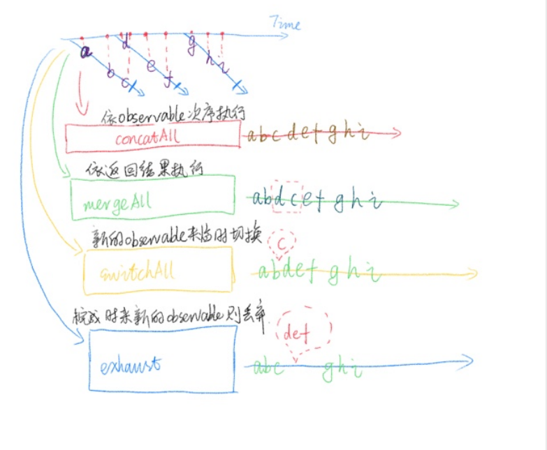

# Hight-Level Observable

> 高阶Observable，假设在 operator 中返回一个 Observable ，由于 operator 本来就会将结果封装成一个 Observable ，所以就成了 Observable 的 Observable 了。这就是高阶 Observable 。

处理高阶 Observable 的时候， 就需要使用到 `concatAll` `mergeAll` `switchALL` `exhuast` 等函数了，下图展示了这几个函数的基本效果

- [目录](./READEME.md)